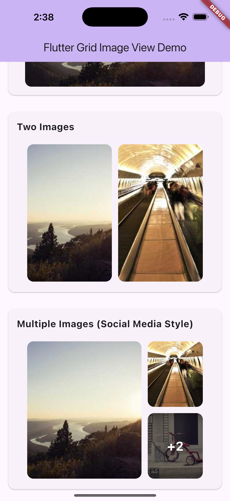

# Flutter Grid Image View

A Flutter package for displaying images in a grid layout with remaining count overlay, perfect for social media style posts.

## 📸 Preview

### Single, Two, and Social Media Style Layout




## Features

- ✨ Responsive grid layout (1, 2, or multiple images)
- 🎨 Highly customizable appearance
- 🔍 Full-screen gallery viewer with zoom and pan
- 🌐 Support for network and asset images
- 📱 Social media post style layout
- 🎯 Tap to navigate functionality
- 🚫 Graceful error handling

## Installation

Add this to your package's `pubspec.yaml` file:

```yaml
dependencies:
  flutter_grid_image_view: ^1.0.0